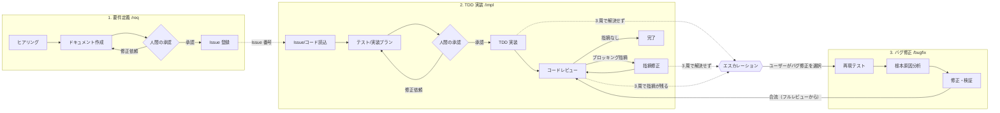

# ワークフロー仕様

piHarness が制御する 3 つのフローの仕様です。フェーズ遷移はすべて `extensions/harness/state.ts` の状態機械で検証され、
エージェントは `harness_*` ツール経由でしか進められません。

## セッションと成果物

**各プロセスは独立したセッションで実行し、プロセス間の連携は成果物（md ファイル）だけで行います。** 前のプロセスの会話は次のセッションに引き継がれません。

| プロセス（= 1 セッション） | フェーズ | 入力成果物 | 出力成果物 |
|---|---|---|---|
| 要件定義 | req_clarify → req_document → req_approval | `qa.md`（ヒアリング記録） | `docs/requirements/*.md`, `docs/design/*.md`, Issue 分割案 |
| Issue 登録 | req_issues → req_done | 承認済みドキュメント, `qa.md` | GitHub Issue（または `docs/issues/*.md`）, `issues.md` |
| プラン作成 | impl_context → impl_plan → impl_plan_approval | `issue.md` | `plan.md` |
| TDD 実装 | impl_tdd | `issue.md`, `plan.md` | コード, `implementation.md` |
| コードレビュー（周回ごと） | impl_review | `issue.md`, `plan.md`, `implementation.md`, 過去の `review-*.md` / `fix-*.md` / `bug-*.md` | `review-N.md` |
| レビュー指摘修正（周回ごと） | impl_fix_review | `review-N.md`, `plan.md`, `implementation.md` | コード, `fix-N.md` |
| バグ修正 | bug_reproduce → bug_analyze → bug_fix | `escalation-N.md`, 直近のテストログ, `issue.md`, `plan.md`, `implementation.md`, 直近の `review-N.md` | コード, `bug-N.md` |

成果物は作業項目ごとのディレクトリに置かれます（Issue 登録先の要件定義書は `docs/`）。

```text
.pi/harness/
├── state.json                 # ワークフロー状態（全セッション共通。直接編集は不可）
├── req-2026-09-28-温度ロガー/   # 要件定義: qa.md, issues.md, handoff.md
└── issue-12/                  # 実装フロー（バグ修正もここ）
    ├── issue.md               # /impl 時に gh issue view で取得した本文
    ├── plan.md                # テスト/実装プラン（承認対象）
    ├── implementation.md      # 実装レポート
    ├── review-1.md, fix-1.md, review-2.md …
    ├── escalation-1.md, bug-1.md
    ├── handoff.md             # セッション切り替えの履歴（入力/出力の一覧）
    └── logs/test-*.log        # テストの全文ログ
```

### セッション切り替えの仕組み

1. ツール（承認・テスト合格後の遷移・レビュー記録など）でプロセス境界をまたぐと、`state.json` に「次のプロセス待ち」が記録され、
   エージェントには「プロセス完了。これ以上作業せず報告して終了」と返します（以降、`harness_*` 以外のツールはブロック）。
2. エージェントが停止すると（`agent_settled`）、拡張が `/harness next` を実行します（`autoHandoff: false` なら手動）。
3. `/harness next` は `handoff.md` に記録を追記し、**新しいセッション**を作成して、スキル + 入力/出力成果物の一覧だけを最初のメッセージとして送ります。
4. 新しいセッションでは拡張が `state.json` から状態を読み込み、毎ターン現在のプロセスと成果物をエージェントに伝えます。

5. 新しいセッションの開始時に、`.pi/harness.json` の `models` からそのプロセス用のモデル・思考レベルを適用します（例: レビューだけ高性能モデル）。

次のプロセスへ進む前に出力成果物が必須です（`implementation.md` / `fix-N.md` / `bug-N.md` / `plan.md` が無いと遷移を拒否）。
`/req`, `/impl`, `/bugfix` もそれぞれ新しいセッションで開始します。pi を再起動した場合は `/harness next` で現在のプロセスを新しいセッションとして再開できます。

エスカレーション中の判断（ループ継続を選んだ場合）は同じセッションで続けます。後から `/harness continue` で継続した場合は、
`escalation-N.md` を入力とする新しいセッションで再開します。

## 全体像



## 1. 要件定義フロー

| フェーズ | 内容 | 書き込み可能 | 次へ進む方法 |
|---------|------|-------------|-------------|
| `req_clarify` | 仕様が明確になるまで `harness_ask` で質問を繰り返す | `docs/`, `.pi/harness/` | `harness_phase → req_document` |
| `req_document` | 要件定義書・設計概要・Issue 分割案を作成 | 同上 | `harness_request_approval (requirements)`／不明点があれば `req_clarify` へ戻る |
| `req_approval` | **人間の承認ゲート** | 同上 | 承認ダイアログ または `/harness approve / revise / reject` |
| `req_issues` | 機能単位の小さな Issue を登録（受け入れ条件必須・依存関係付き） | 同上 | `harness_create_issues` |
| `req_done` | 完了報告 | 同上 | — |

- 承認前の `harness_create_issues` は拒否されます。bash での `gh issue create` もフロー中はブロックされます。
- `harness_create_issues` は登録前にもう一度ユーザーに確認します（外部への書き込みのため）。
- gh CLI が未インストール/未認証の場合は `docs/issues/NN-<slug>.md` に保存します。

## 2. TDD 実装フロー

| フェーズ | 内容 | 書き込み可能 | 次へ進む方法 |
|---------|------|-------------|-------------|
| `impl_context` | Issue・関連ドキュメント・コードベースを読む | `.pi/harness/` のみ | `harness_phase → impl_plan` |
| `impl_plan` | テストプラン + 実装プランを作成 | `.pi/harness/` のみ | `harness_request_approval (plan)` |
| `impl_plan_approval` | **人間の承認ゲート** | `.pi/harness/` のみ | 承認ダイアログ または `/harness approve` |
| `impl_tdd` | Red → Green → Refactor | 制限なし | 全テスト green かつ未テスト変更なしで `harness_phase → impl_review` |
| `impl_review` | 多角的コードレビュー（1 周目フル / 2 周目以降軽量） | `.pi/harness/` のみ | `harness_record_review` |
| `impl_fix_review` | ブロッキング指摘の修正 | 制限なし | 全テスト green かつ未テスト変更なしで `harness_phase → impl_review` |
| `impl_done` | 完了報告 | `.pi/harness/` のみ | — |

### テストループ

- `harness_run_tests` は設定されたテストスイート **全体** を実行します（結果をエージェントの自己申告に頼らない）。
- `expect: "red"` の失敗は TDD の Red 確認であり、ループ回数に数えません。Red 期待で合格した場合は「テストが要件を捉えていない」と警告します。
- `expect: "green"` の **連続失敗** がループ回数です。合格でリセットされます。
- 連続失敗が `maxTestLoops`（既定 3）に達するとエスカレーションします。
- 最後の合格以降に `edit` / `write` でファイルが変更されると「未テストの変更あり」となり、レビューへ進めません。

### レビューループ

- 重大度 `blocker` / `major`（設定可）の指摘がブロッキングです。`minor` / `nit` は報告のみで完了を妨げません。
- 1 周目はフルレビュー（requirements / correctness / tests / security / performance / maintainability / operability）。
- 2 周目以降は軽量レビュー（前回指摘の解消確認 + 新規差分の重大な問題のみ）。
- レビュー記録は作業ディレクトリの `review-<N>.md` に保存され、各周回のレビュー・修正はそれぞれ新しいセッションで行います。
- `maxReviewLoops`（既定 3）周してもブロッキング指摘が残るとエスカレーションします。

## エスカレーション

ループ上限に達すると状態は `escalated` になり、コード変更はブロックされます。UI があればその場で選択肢を表示します。

| 選択 | 動作 |
|------|------|
| ループを継続する | カウンタをリセットして元のフェーズへ戻る（レビューループの場合は修正フェーズから、追加で `maxReviewLoops` 周を許可） |
| 独立したバグ修正フローで対応する | 実装フローを退避して `/bugfix` と同じフローを開始 |
| 手動で対応する | フローを一時停止。後で `/harness continue` や `/bugfix` で再開 |
| フローを中止する | フロー終了 |

UI がない場合（RPC/print モード）は停止してユーザーに報告し、コマンドでの判断を待ちます。

## 3. バグ修正フロー

| フェーズ | 内容 | 書き込み可能 | 次へ進む方法 |
|---------|------|-------------|-------------|
| `bug_reproduce` | バグを再現するテストを書き、red を確認 | 制限なし | `harness_phase → bug_analyze` |
| `bug_analyze` | 根本原因分析、バグレポート作成 | `.pi/harness/` のみ | `harness_phase → bug_fix`（再現が不十分なら `bug_reproduce` へ） |
| `bug_fix` | 最小修正、全テスト green | 制限なし | 全テスト green かつ未テスト変更なしで `harness_phase → bug_done`（再分析なら `bug_analyze` へ） |
| `bug_done` | 完了 → 合流 | `.pi/harness/` のみ | 合流先があれば確認後 `impl_review` へ |

- 実装フロー中（エスカレーション中を含む）に起動すると、その Issue とフェーズを退避し、完了後に **`impl_review` から** 合流します。
  バグ修正でコードが変わっているため、レビューカウンタをリセットしてフルレビューから行います（テストは bug_fix の最後で合格済み）。
- バグ修正フロー内の修正ループも `maxTestLoops` で再エスカレーションします。そこから再度 `/bugfix` を選んでも合流先は保持されます。
- 単独で起動した場合（実装フローなし）は、完了で終了します。

## 状態の永続化

- 状態は `.pi/harness/state.json` に保存され、すべてのセッションで共有されます（セッションの会話やツリー分岐には依存しません）。
- 同時に進行できるフローは 1 つです（新しいフローを開始すると確認のうえ置き換えます）。
